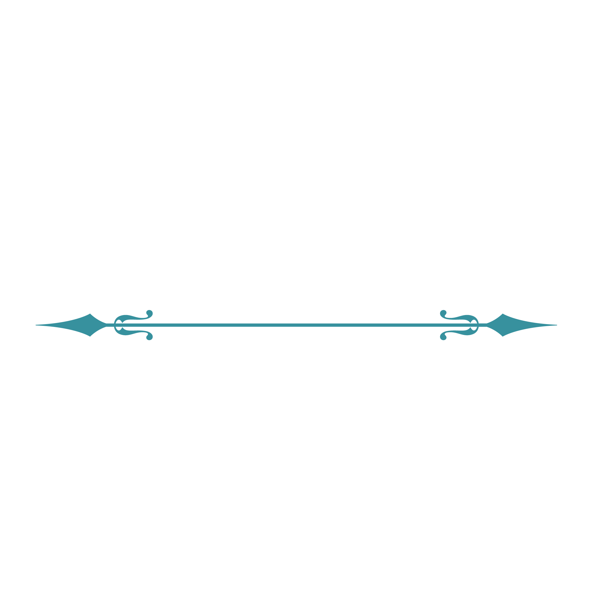
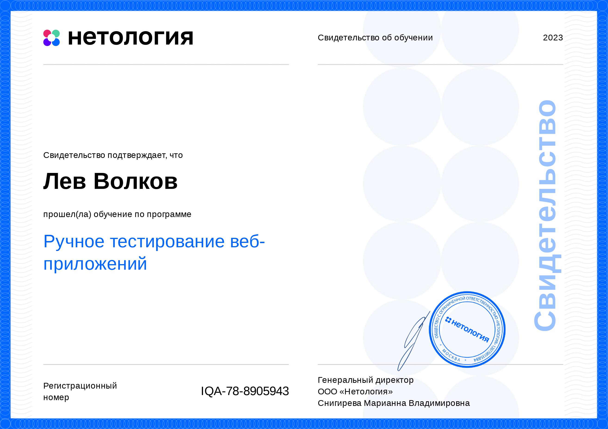
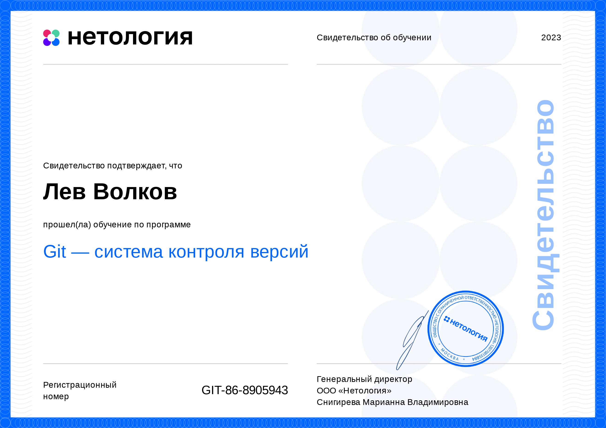
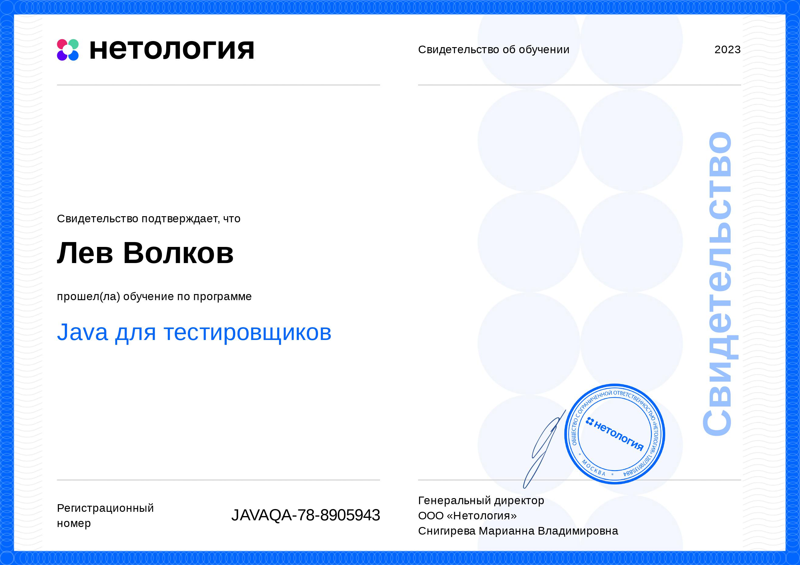

*<h4 align="center">Меня зовут Лев. Я начинающий специалиств области тестирования программного обеспечения,   набирающий знания и опыт в ходе прохождения курса по тестированию в [Нетологии](https://netology.ru/programs/qa-middle#/main).  Мои навыки и знания охватывают различные инструменты и технологии, что подтверждено практическим опытом. </h4>*

<!-- Ручное тестирование веб-приложений -->

<table align="left" width="100%" >
  <tr>
    <td align="left" width="100%" >

             

*<h3 align="center"> «Ручное тестирование   веб-приложений» </h3>*

*
*

*
 &nbsp; Репозитории домашних заданий 
*
*
*
*<h5><a href="https://github.com/netology-code/iqa-homeworks">Учебные материалы</a></h5>*
*<h5><a href="https://github.com/netology-code/iqa-diplom">Заданиия курсовой</a></h5>*
*<h5><a href="https://docs.google.com/spreadsheets/d/1izwdoHvAUXkukRRkRCoaPGdZd58F3e-VzDqhPq9L9ys/edit?usp=sharing"> Чеклист <a/> для функциональной проверки личного кабинета зарегистрированного   авторизованного пользователя, включая функционал разделов,   на сайте Henderson  </h5>*
*<h5><a href="https://docs.google.com/spreadsheets/d/1G3ZCS60na-KQbO-MeoA0ctaEfOO8Q-_NehnNrnrAL6g/edit?usp=sharing"> Набор тест-кейсов </a> на проверку функционала восстановление пароля </h4>*
*<h5><a href="https://docs.google.com/spreadsheets/d/1AtjTjpJy5xd7R1_6svUvym4Pxv-HdDvtYA7a-Rwi2S0/edit?usp=sharing"> Баг-репорты </a> на основе скриншота </h5>*
*<h5><a href="https://docs.google.com/document/d/1tFmdkzxJWfE0AnDIqFiGZpvuboc3EqbBWGtiQaJtZg4/edit?usp=sharing"> Тестирование верстки </a>   страницы карточки товара с максимальной и минимальной ценой</h5>*
*<h5><a href="https://docs.google.com/document/d/1XnjWPBnY48-4_957HTD_KNQv_oRo1oMqW7xYP8lB6WU/edit?usp=sharing"> Клиент сервер </a>   ищем запрос, в котором есть нужные параметры, найти,   как же выглядят параметры deviceUUID,   requestID и status</h5>*

             

 

 

</td>
</tr>
</table>

<!-- Git-система контроля версий --> 

<table align="right" width="100%" >
  <tr>
    <td align="right" width="100%" >

             

*<h3 align="center">  «Git-система   контроля версий» </h3>*

*
*

*
 Полезные материалы 
*
*
*
*<h5><a href="https://github.com/netology-code/guides/blob/master/git-basics/GitMaterialsAll.md"> Материалы по работе с Git и GitHub </a></h5>*

             

 

 

</td>
</tr>
</table>

<!--Java для тестеровщиков-->

<table align="left" width="100%" >
  <tr>
    <td align="left" width="100%" >

 

             

*<h3 align="center"> «Java для   тестировщиков» </h3>*

*
*

*
 Репозитории домашних заданий 
*
*
*
*<h5><a href="https://github.com/LevVolkov/javaqa1"> 1 «Введение в Java» </a> </h5>*
*<h5> Версионируем проект с помощью Git, пишем баг-репорт в GitHub Issues </h5>*
*<h5><a href="https://github.com/LevVolkov/javaqa2"> 2.1 «Примитивные типы данных и условные операторы» </a> </h5>*
*<h5><a href="https://github.com/LevVolkov/javaqa3"> 2.2 «Примитивные типы данных и условные операторы» </a> </h5>*
*<h5> Практикуемся в использовании условных операторов </h5>*
*<h5><a href="https://github.com/LevVolkov/Testability1"> 3.1 «Testability. Введение в ООП» </a></h5>*
*<h5><a href="https://github.com/LevVolkov/Testability2"> 3.2 «Testability. Введение в ООП» </a></h5>*
*<h5><a href="https://github.com/LevVolkov/Testability3"> 3.3 «Testability. Введение в ООП» </a></h5>*
*<h5> Пишем свои сервисные классы, многофайловую программу </h5>*
*<h5><a href="https://github.com/LevVolkov/maven">4 «Система сборки Maven»</a></h5>*
*<h5> Создаем maven-проекты, пишем юнит-тесты с помощью JUnit 5, используем maven-плагины </h5>*
*<h5><a href="https://github.com/LevVolkov/PackagesAndCycles"> 5 «Пакеты и циклы» </a></h5>*
*<h5> Используем циклы в программах, параметризируем юнит-тесты.   Практикуемся с пакетированием классов </h5>*
*<h5><a href="https://github.com/LevVolkov/StringsAndArrays"> 6 «Строки и массивы» </a></h5>*
*<h5> Используем циклы для работы с массивами </h5>*
*<h5><a href="https://github.com/LevVolkov/JaCoCoCI"> 7 «Выстраивание процесса непрерывной интеграции» </a></h5>*
*<h5> Настраиваем CI на основе GitHub Actions </h5>*
*<h5><a href="https://github.com/LevVolkov/ObjectOrientedProgrammingPrinciples"> 8 «Объектно-ориентированное программирование: ключевые принципы» </a></h5>*
*<h5> Проектируем объекты для хранения данных </h5>*
*<h5><a href="https://github.com/LevVolkov/Radio"> 9 «Объектно-ориентированное программирование и проектирование» </a></h5>*
*<h5> Проектируем объекты, имеющие и поля, и методы </h5>*
*<h5><a href="https://github.com/LevVolkov/Radio"> 10 «Объекты с внутренним состоянием, управление состоянием при тестировании» </a></h5>*
*<h5> Управляем начальным состоянием объектов через конструкторы </h5>*
*<h5><a href="https://github.com/LevVolkov/Mockito"> 11 «Композиция и зависимость объектов. Mockito при создании автотестов» </a></h5>*
*<h5> Проектируем классы, внутреннее состояние которых содержит наборы данных </h5>*
*<h5><a href="https://github.com/LevVolkov/InheritanceIssues"> 12 «Наследование и расширяемость систем. Проблемы наследования» </a></h5>*
*<h5> Связываем классы отношением наследования, переопределяем методы в классах наследников,   пользуемся полиморфизмом классов </h5>*
*<h5><a href="https://github.com/LevVolkov/ExceptionSituations"> 13 «Исключительные ситуации и их обработка. Тестирование исключений» </a></h5>*
*<h5> Добавляем логику исключений в приложение, тестируем логику исключений в приложении </h5>*
*<h5><a href="https://github.com/LevVolkov/SortAndCompare"> 14 «Интерфейсы для организации малой связности. Обобщённое программирование (Generics)» </a></h5>*
*<h5> Сортируем объекты, сравниваем объекты с помощью Comparable и Comparator </h5>*
*<h5><a href="https://github.com/LevVolkov/UseCollections"> 15 «Collections Framework. CRUD и тестирование систем, управляющих набором объектов» </a></h5>*
*<h5> Используем коллекции для работы с наборами элементов </h5>*
*<h5><a href="https://github.com/DenIvanof/javaqa-team-diplom-2"> Командный проект по курсу «Java для тестировщиков» </a></h5>*
*<h5> Тестируем приложение для операций с банковскими счетами </h5>* 
*<h5> Составляем баг-репорты на найденные баги </h5>*
*<h5> Закрываем составленные коллегой баг-репорты, исправив баги </h5>*

             

             

</td>
</tr>
</table>

<!-- Автоматизированное тестирование -->

<table align="right" width="100%" >
  <tr>
    <td align="right" width="100%" >

             

*<h3 align="center"> «Автоматизированное  тестирование» </h3>*

*
*

*
 Репозитории домашних заданий 
*
*
*
*<h5 align="center">[ Учебные материалы ](https://github.com/netology-code/aqa-code)</h5>*
*<h5><a href="https://github.com/LevVolkov/CashBackHacker"> 1 «Основы автоматизации» </a></h5>*
*<h5> Создание проекта на базе Gradle, не добавляя в него внешних зависимостей </h5>*
*<h5><a href="https://github.com/LevVolkov/API-CI"> 2.1 «Тестирование API, CI» </a></h5>*
*<h5> Настраиваем AppVeyor, тренируемся с Get запросами</h5>*
*<h5><a href="https://github.com/LevVolkov/PostmanEcho"> 2.2 «Тестирование API, CI» </a></h5>*
*<h5> Тренируемся с Post запросами, отправка тела запроса </h5>*
*<h5><a href="https://github.com/LevVolkov/TestingWeb"> 3 «Тестирование веб-интерфейсов» </a></h5>*
*<h5> Автоматизируем тестирование формы заказа карты с использованием Selenium, библиотеки Webdriver Manager </h5>*
*<h5><a href="https://github.com/LevVolkov/Selenide"> 4 «Selenide» </a></h5>*
*<h5> Автоматизируем тестирование формы заказа доставки карты с использованием Selenide </h5>*

 

             

             

</td>
</tr>
</table>

<!-- GitHub stats -->

<table>
  <tr>
    <td>
        
     

    
   

      </td>
</tr>
</table>

<table align="right" width="100%">
  <tr>
    <td align="right" width="100%">

             

      
 

   

  

             

      
   </td>
  </tr>
</table>

<table align="left" width="100%">
  <tr>
    <td align="left" width="100%">

             

 
 

 

             

  </td>
</tr>
</table>

<table align="right" width="100%">
  <tr>
    <td align="right" width="100%">

             

      

             

      
 </td>
  </tr>
</table>

<table align="left" width="100%">
  <tr>
    <td align="left" width="100%">

             

      
 

 
 

             

 </td>
  </tr>
</table>

<table>
  <tr>
    <td>

    

</td>
  </tr>
</table>

 

