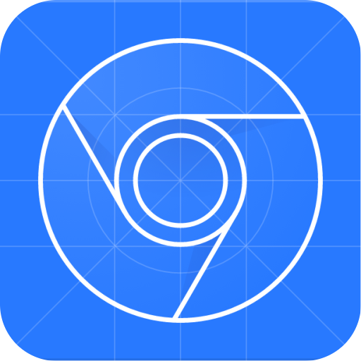
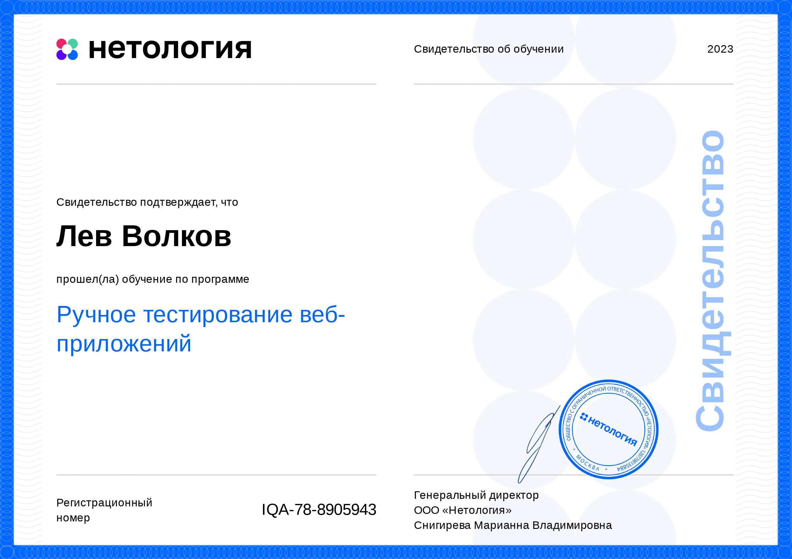
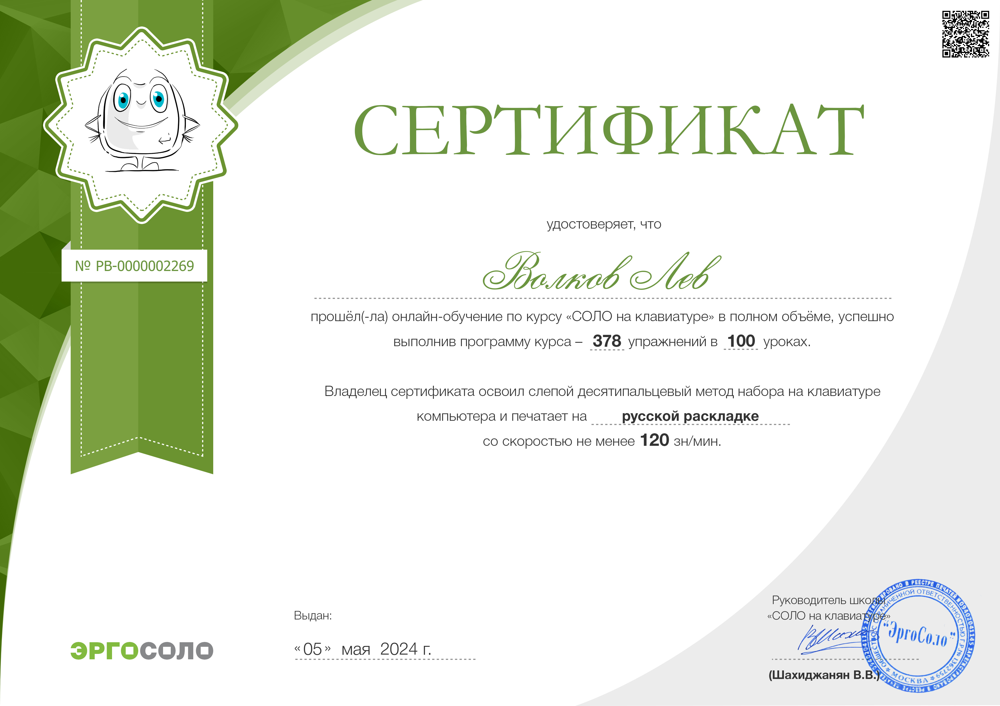
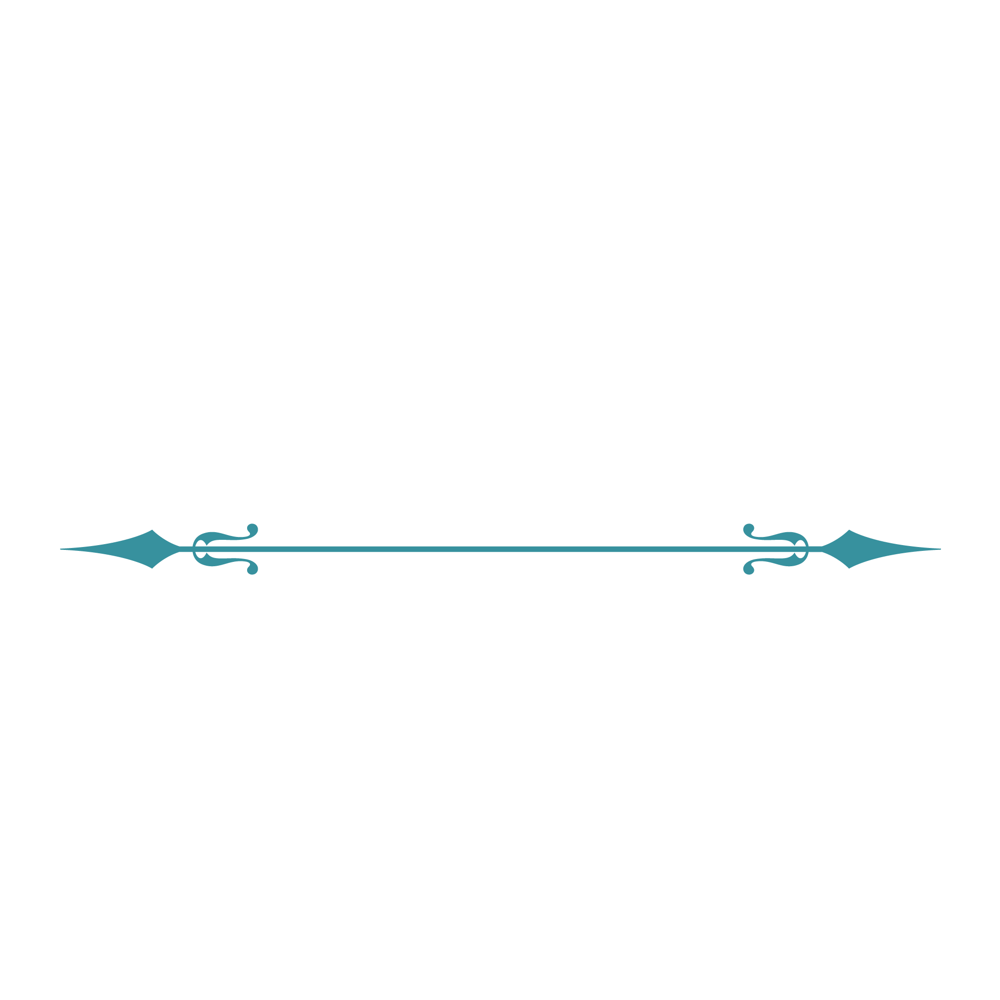
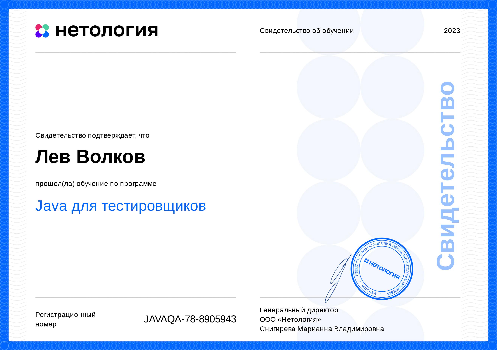
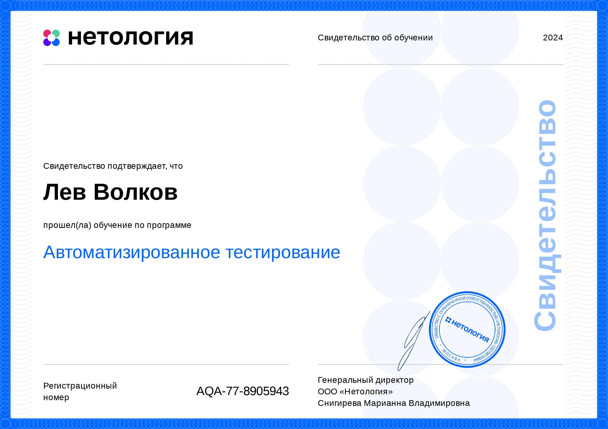

  
  

***
Меня зовут Лев. Я начинающий специалист в области тестирования программного обеспечения,   набирающий знания и опыт в ходе прохождения курса по тестированию в [Нетологии](https://netology.ru/programs/qa-middle#/main).  Мои навыки и знания охватывают различные инструменты и технологии, что подтверждено практическим опытом. 
***

 

<!-- Ручное тестирование веб-приложений -->

<table align="left" width="100%" >
  <tr>
    <td align="left" width="100%" >

             

*<h3 align="center"> «Ручное тестирование   веб-приложений» </h3>*

  &nbsp;
  &nbsp;
 

*
*

*
 &nbsp; Курсовая работа 
*

*<table border="0" align="center" width="100%">*
	<tr>
                <td>

		***
<a href="https://github.com/netology-code/iqa-homeworks">Учебные материалы</a>  
                <a href="https://github.com/netology-code/iqa-diplom"> Задания курсовой </a>
***</td>
	</tr>
        <tr>
	        <td align="center">***
«<a href="https://docs.google.com/spreadsheets/d/1izwdoHvAUXkukRRkRCoaPGdZd58F3e-VzDqhPq9L9ys/edit?usp=sharing"> Чеклист 
                <a/>   для функциональной проверки личного кабинета зарегистрированного   авторизованного  пользователя, включая функционал разделов, 
                  на сайте Henderson »
***</td>
	</tr>
        <tr>
	        <td align="center">***
«<a href="https://docs.google.com/spreadsheets/d/1G3ZCS60na-KQbO-MeoA0ctaEfOO8Q-_NehnNrnrAL6g/edit?usp=sharing"> Набор 
                тест-кейсов </a>   на проверку функционала восстановление пароля »
***</td>
	</tr>
        <tr>
	        <td align="center">***
«<a href="https://docs.google.com/spreadsheets/d/1AtjTjpJy5xd7R1_6svUvym4Pxv-HdDvtYA7a-Rwi2S0/edit?usp=sharing"> Баг- 
                репорты </a>   на основе скриншота »
***</td>
	</tr>
        <tr>
	        <td align="center">***
«<a href="https://docs.google.com/document/d/1tFmdkzxJWfE0AnDIqFiGZpvuboc3EqbBWGtiQaJtZg4/edit?usp=sharing"> 
                Тестирование верстки </a>   страницы карточки товара с максимальной и минимальной ценой »
***</td>
	</tr>
        <tr>
	        <td align="center">***
«<a href="https://docs.google.com/document/d/1XnjWPBnY48-4_957HTD_KNQv_oRo1oMqW7xYP8lB6WU/edit?usp=sharing"> Клиент сервер </a>   ищем запрос, в котором есть нужные параметры, найти, как же выглядят параметры   deviceUUID, requestID и status »
***</td>
	</tr>
        <tr>
	       <td>  
 &nbsp; 
              
 </td>
 </tr>
</table>

             

 

</td>
</tr>
</table>

<!-- Git-система контроля версий --> 

<table align="right" width="100%" >
  <tr>
    <td align="right" width="100%" >

             

*<h3 align="center">  «Git-система   контроля версий» </h3>*

  &nbsp;
  &nbsp;
 
 
 

*
*

*
 Полезные материалы 
*

***<table border="0" align="center" width="100%">***
	<tr>
                <td>

                
***<a href="https://github.com/netology-code/guides/blob/master/git-basics/GitMaterialsAll.md"> Материалы по работе с Git и GitHub </a>***  
	</tr>
        <tr>
	       <td>  

 </td>
 </tr>
  </table>
  

             

 

</td>
</tr>
</table>

<!--Java для тестеровщиков-->

<table align="left" width="100%" >
  <tr>
    <td align="left" width="100%" >

 

             

*<h3 align="center"> «Java для   тестировщиков» </h3>*

   &nbsp;
   &nbsp;
   &nbsp;
   

*
*

*
 Репозитории домашних заданий 
*

***<table border="0" align="center" width="100%">***
	<tr>
                <td>

                ***
<a href="https://github.com/LevVolkov/javaqa1">«1 Введение в Java» </a>
		
Версионируем проект с помощью Git, пишем баг-репорт в GitHub Issues.
***</td>
	</tr>
	<tr>
		<td align="center">***
<a href="https://github.com/LevVolkov/javaqa2">«2.1 Примитивные типы данных и условные  операторы» </a>
	         <a href="https://github.com/LevVolkov/javaqa3">«2.2 Примитивные типы данных и условные операторы» </a>
                
Практикуемся в использовании условных операторов. 
***</td>
	</tr>
	<tr>
		<td align="center">***
<a href="https://github.com/LevVolkov/Testability1">«3.1 Testability. Введение в ООП» </a>
                 <a href="https://github.com/LevVolkov/Testability2">«3.2 Testability. Введение в ООП» </a>
		 <a href="https://github.com/LevVolkov/Testability3">«3.3 Testability. Введение в ООП» </a>
                
Пишем свои сервисные классы, многофайловую программу. 
***</td>
	</tr>
	<tr>
		<td align="center">***
<a href="https://github.com/LevVolkov/maven">«4 Система сборки Maven»</a>

		
Создаем maven-проекты, пишем юнит-тесты с помощью JUnit 5, используем   maven-плагины. 
***</td>
	</tr>
	<tr>
		<td align="center">***
<a href="https://github.com/LevVolkov/PackagesAndCycles">«5 Пакеты и циклы» </a>

		
Используем циклы в программах, параметризируем  юнит-тесты.  Практикуемся  с пакетированием классов. 
***</td>
        </tr>
	<tr>
		<td align="center">***
<a href="https://github.com/LevVolkov/StringsAndArrays">«6 Строки и массивы»</a>

		
Используем циклы для работы с массивами.
***</td>
	</tr>
	<tr>
                <td align="center">***
<a href="https://github.com/LevVolkov/JaCoCoCI"> «7 Выстраивание процесса непрерывной интеграции» </a>

		
Настраиваем CI на основе GitHub Actions.
***</td>
	</tr>
	<tr>
		<td align="center">***
<a href="https://github.com/LevVolkov/ObjectOrientedProgrammingPrinciples"> «8 Объектно-ориентированное программирование: 
                ключевые принципы» </a>

		
Проектируем объекты для хранения данных.
***</td>
	</tr>
	<tr>
		<td align="center">***
<a href="https://github.com/LevVolkov/Radio"> «9 Объектно-ориентированное программирование и проектирование» </a>

		
Проектируем объекты, имеющие и поля, и методы.
***</td>
	</tr>
	<tr>
		<td align="center">***
<a href="https://github.com/LevVolkov/Radio"> «10 Объекты с внутренним состоянием, управление состоянием при тестировании» </a>

		
Управляем начальным состоянием объектов через конструкторы.
***</td>
	</tr>
	<tr>
		<td align="center">***
<a href="https://github.com/LevVolkov/Mockito"> «11 Композиция и зависимость объектов. Mockito при создании автотестов» </a>

		
 Проектируем классы, внутреннее состояние которых содержит наборы данных.
***</td>
	</tr>
	<tr>
		<td align="center">***
<a href="https://github.com/LevVolkov/InheritanceIssues"> «12 Наследование и расширяемость систем. Проблемы наследования» </a>

		
Связываем классы отношением наследования, переопределяем методы в классах   наследников, пользуемся полиморфизмом классов.
***</td>
        </tr>
	<tr>
		<td align="center">***
<a href="https://github.com/LevVolkov/ExceptionSituations"> «13 Исключительные ситуации и их обработка. Тестирование 
                исключений» </a>

		
Добавляем логику исключений в приложение, тестируем логику исключений в  приложении.
***</td>
		</tr>
	<tr>
		<td align="center">***
<a href="https://github.com/LevVolkov/SortAndCompare"> «14 Интерфейсы для организации малой связности. Обобщённое  
                программирование (Generics)» </a>

		
Сортируем объекты, сравниваем объекты с помощью Comparable и Comparator.
***</td>
		</tr>
	<tr>
		<td align="center">***
<a href="https://github.com/LevVolkov/UseCollections"> «15 Collections Framework. CRUD и тестирование систем, управляющих 
                 набором объектов» </a>

		
Используем коллекции для работы с наборами элементов.
***</td>
		</tr>
	<tr>
		<td align="center">***
<a href="https://github.com/DenIvanof/javaqa-team-diplom-2"> Командный проект по курсу «Java для тестировщиков» </a>

		
Тестируем приложение для операций с банковскими счетами. Составляем баг-репорты на найденные баги. 
                Закрываем составленные коллегой баг-репорты, исправив баги.
***</td>
		</tr>
        <tr>
	       <td>  

 </td>
	</tr>
  </table>

             

             

</td>
</tr>
</table>

<!-- Автоматизированное тестирование -->

<table align="right" width="100%" >
  <tr>
    <td align="right" width="100%" >

             

*<h3 align="center"> «Автоматизированное  тестирование» </h3>*

   &nbsp;
   &nbsp;
   
   &nbsp;
   &nbsp;
   &nbsp;
   

*
*

*
 Репозитории домашних заданий 
*

***<table border="0" align="center" width="100%">***
	<tr>
                <td>

		***
<a href="https://github.com/LevVolkov/CashBackHacker"> «1 Основы автоматизации» </a>
 
                
Создание проекта на базе Gradle, не добавляя в него внешних зависимостей. 
***</td>
        </tr>
        <tr>
               <td align="center">***
<a href="https://github.com/LevVolkov/API-CI"> «2.1 Тестирование API, CI» </a>

	       
Настраиваем AppVeyor, тренируемся с Get запросами. 
***</td>
	</tr>
        <tr>
               <td align="center">***
<a href="https://github.com/LevVolkov/PostmanEcho"> «2.2 Тестирование API, CI» </a>

	       
Тренируемся с Post запросами, отправка тела запроса. 
***</td>
	</tr>
        <tr>
               <td align="center">***
<a href="https://github.com/LevVolkov/TestingWeb"> «3 Тестирование веб-интерфейсов» </a>

	       
Автоматизируем тестирование формы заказа карты с использованием Selenium,   библиотеки Webdriver Manager
***</td>
	</tr>
        <tr>
               <td align="center">***
<a href="https://github.com/LevVolkov/Selenide"> «4 Selenide» </a>

	       
 Автоматизируем тестирование формы заказа доставки карты   с использованием Selenide
***</td>
	</tr>
        <tr>
               <td align="center">***
<a href="https://github.com/LevVolkov/Patterns1"> «5.1 Patterns» </a> 
	       <a href="https://github.com/LevVolkov/Patterns2"> «5.2 Patterns» </a>

	       
Реализуем классы датагенератор, используем библиотеку Faker для генерации  данных, библиотеку Gson чтобы иметь возможность сериализовать Java-объекты   в JSON, используем Lombok
***</td>
	</tr>
        <tr>
               <td align="center">***
<a href="https://github.com/LevVolkov/PageObject"> «6 BDD (Behaviour Driven Development), Page Object's» </a>

	       
Прорабатываем класс DataHelper и пейдж объекты, реализуем достаточное   количество тестов, заводим репорт на обнаруженный дефект.
***</td>
	</tr>
        <tr>
               <td align="center">***
<a href="https://github.com/LevVolkov/DockerPostgreSQL"> «7 Docker PostgreSQL» </a>

	       
Настройка контейнера, устанавливаем параметры для запуска приложения
***</td>
	</tr>
        <tr>
               <td align="center">***
<a href="https://github.com/LevVolkov/SQL_deadline"> «8 SQL» </a>

	       
Реализуем класс датахелпера, пейдж объекты, спомогательный   класс взаимодействия с базой данных
***</td>
	</tr>
        <tr>
               <td align="center">***
<a href="https://github.com/LevVolkov/AllureReport"> «9 Репортинг Allure» </a>

	       
Подключаем Allure, настраиваем интеграцию с Selenide
***</td>
	</tr>
        <tr>
	       <td align="center">***
<a href="https://github.com/LevVolkov/TestPlan"> «10 Заключительная лекция» </a>

	       
 Пишем план автоматизации тестирования сценария перехода к форме записи   и заполнения этой формы.
***</td>
	</tr>
        <tr>
	       <td align="center">***
<a href="https://github.com/LevVolkov/Course-work"> Курсовой проект по модулю «Автоматизация тестирования»   для профессии «Инженер по тестированию» </a>

	       
 Автоматизация тестирования комплексного сервиса, взаимодействующего   с СУБД и API банка. 
***</td>
	</tr>
        <tr>
	       <td>  

 </td>
	</tr>
</table>

  

             

             

</td>
</tr>
</table>

<!-- GitHub stats -->

<table>
  <tr>
    <td>
        
     

    
   

      </td>
</tr>
</table>

<table align="right" width="100%">
  <tr>
    <td align="right" width="100%">

             

      
 

   

  

             

      
   </td>
  </tr>
</table>

<table align="left" width="100%">
  <tr>
    <td align="left" width="100%">

             

 
 

 

             

  </td>
</tr>
</table>

<table align="right" width="100%">
  <tr>
    <td align="right" width="100%">

             

      

             

      
 </td>
  </tr>
</table>

<table align="left" width="100%">
  <tr>
    <td align="left" width="100%">

             

      
 

 
 

             

 </td>
  </tr>
</table>

<table>
  <tr>
    <td>

    

</td>
  </tr>
</table>

